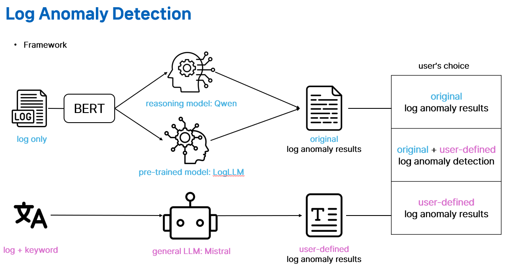

# 🕵️ Log Anomaly Detection (LAD) Framework
LLM을 활용한 로그 이상 탐지 프레임워크

## 🖼️ 프레임워크 개요
본 프레임워크는 두 가지 독립적인 경로를 통해 로그 이상 탐지를 수행함.

1.  **Original Path (Log Only):**
    * 사전학습 된 log dataset(BGL, HDFS_v1, Thunderbird)에 대해서는 `LogLLM`을 사용하고, 그 외의 경우, LLM(`Qwen`)의 reasoning 능력을 이용하여 이상탐지를 수행함.

2.  **User-Defined Path (Log + Keyword):**
    * 사용자가 정의한 `Keyword`와 LLM에 함께 입력하여, 사용자 의도에 맞는 맞춤형 이상 징후를 탐지함.

## 🚀 시작하기 (Getting Started)
(통합 후 업데이트 예정)
